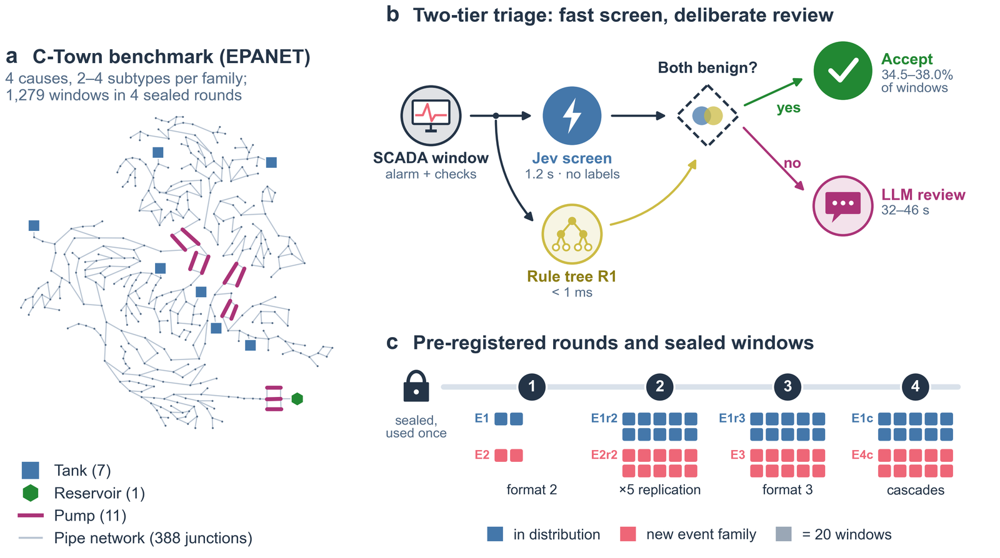
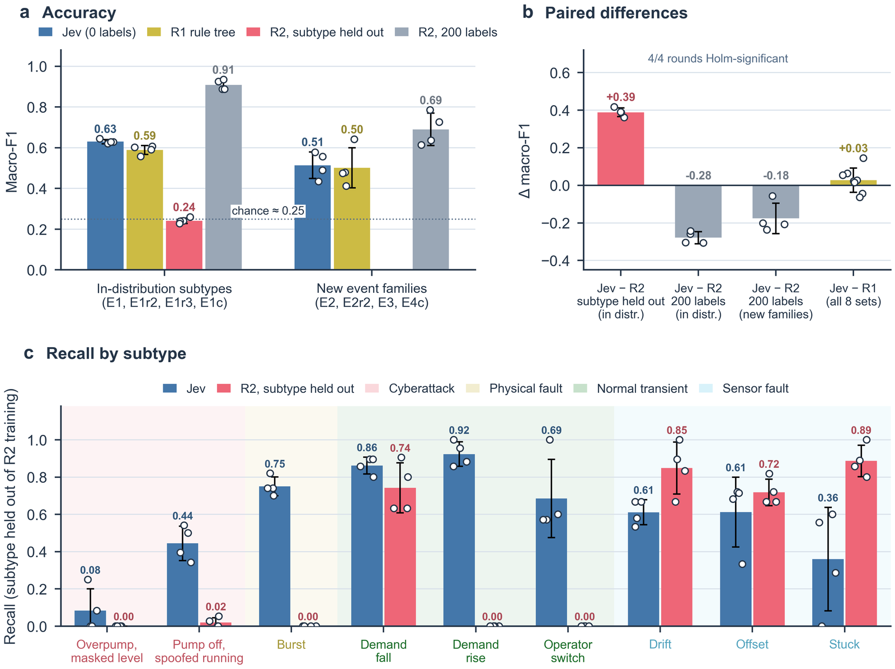
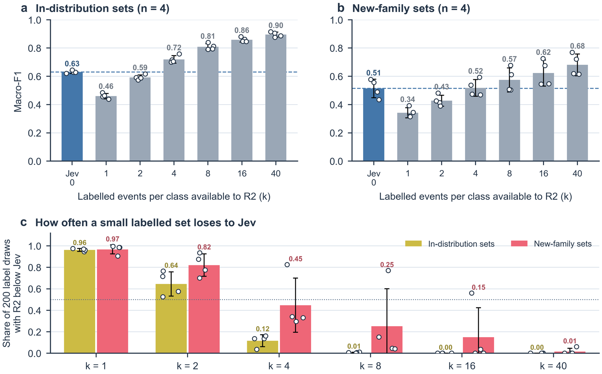
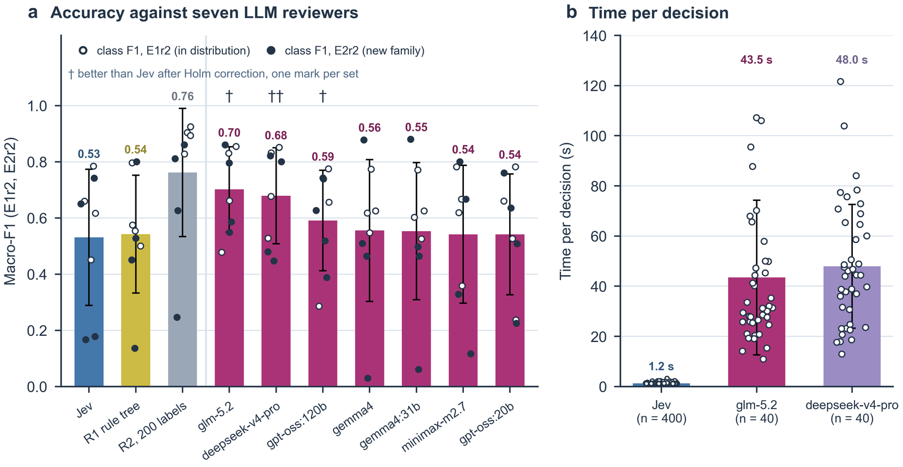
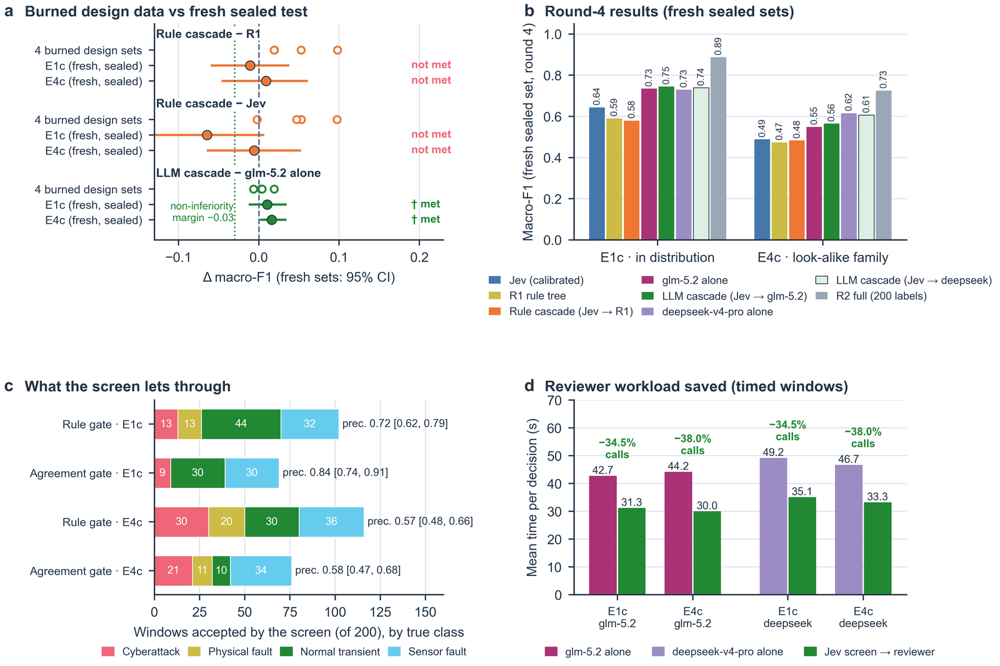
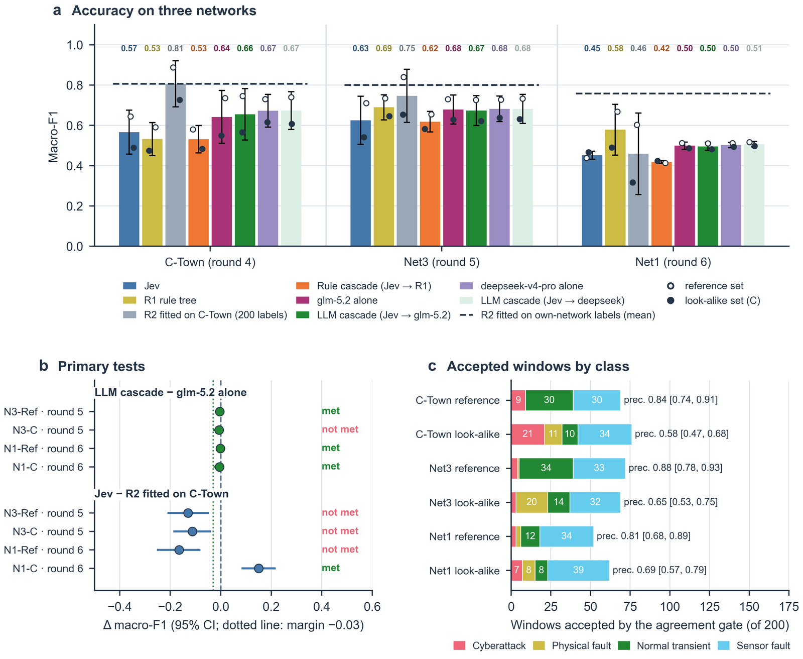

<div align="center">

# HydroJEV

### A One-Second, Training-Free Screen for Cyber-Attack and Fault Attribution in Water Distribution Networks

Tianwei Mu

[**Quick start**](#quick-start) · [**Reproducing the paper**](#reproducing-the-paper) · [**Results**](#main-results) · [**Citation**](#citation)


[](https://arxiv.org/abs/2610.02048)
</div>

---

<p align="center"></p>
<p align="center"><em><b>Figure 1.</b> Study design. SCADA windows from stochastic EPANET simulations are converted into a typed evidence state; Jev returns calibrated class probabilities in about one second; benign verdicts confirmed by a rule tree are settled, and everything else is escalated to a deliberate LLM reviewer.</em></p>

## TL;DR

When a SCADA alarm fires, an operator must decide **fast** whether it is a **cyberattack**, a **physical fault**, a **normal transient** or a **faulty sensor**. Supervised classifiers need labelled incidents that utilities rarely have; frontier LLMs take tens of seconds per decision. HydroJEV tests whether **Jev**, a training-free typed-judgment model, can act as the **first tier** of this triage.

- ⚡ **1.2 s per decision**, 20–40× faster than frontier LLM reviewers.
- 🧪 **Zero labels.** Only a label-free prior correction. Matches an expert rule tree in distribution (macro-F1 0.62–0.64 vs. 0.56–0.61).
- 🆕 **Robust to unseen event subtypes.** Beats a supervised classifier by **+0.36 to +0.42 macro-F1** on subtypes absent from its labels, in all four C-Town rounds.
- 🔀 **Gated cascade.** Accepting only benign Jev verdicts confirmed by the rule tree spares an LLM reviewer **35–38 %** of windows at no loss of macro-F1.
- 🌐 **Transfers unchanged** to EPANET Net3 and Net1: the cascade stays within the non-inferiority margin on all four transfer sets.
- 🔒 **Six sealed, pre-registered rounds** (1,279 C-Town windows plus 800 transfer windows). Each sealed set was evaluated exactly once.

## Method at a glance

| Component | What it does | Code |
|---|---|---|
| **Event generator** | Stochastic 48–54 h EPANET/WNTR simulations of C-Town, Net3 and Net1. Produces the *true* hydraulic state and a *reported* SCADA historian, with 4 classes × several mechanism-defined subtypes. | `hydrojev/benchmarks/jev_pilot_p2v2.py` |
| **Evidence state** | Converts a 6 h window into typed, label-free evidence: physics cross-checks (mass balance, pump curve, level–flow consistency), residual summaries and check statuses. | `jev_pilot_p2v2.py`, `jev_pilot_r4.py` |
| **Jev screen** | Training-free typed judgment returning class probabilities, followed by an inductive label-free prior correction (Saerens-style EM on an unlabelled development set). | `hydrojev/arbiter/`, `jev_pilot_p2v2.py` |
| **Baselines** | R1: six-branch rule tree fixed before any Jev call. R2: logistic regression (full, leave-one-subtype-out, k-shot). Seven LLMs via Ollama with the identical state and question. | `jev_pilot_p2v2_eval*.py`, `llm_baselines*.py` |
| **Cascades** | *Rule cascade* accepts every benign Jev verdict. *Gated LLM cascade* accepts a benign Jev verdict only when R1 agrees, and sends the rest to the LLM. | `jev_cascade*.py` |
| **Statistics** | Paired, class-stratified bootstrap; Holm correction within each round; Wilson intervals; pre-registered margins. | `*_eval*.py` |

## Main results

<p align="center"></p>
<p align="center"><em><b>Figure 2.</b> (a) Macro-F1 in distribution and on new event families. (b) Paired differences: Jev beats the supervised model when the evaluated subtype is withheld from its labels (+0.39, 4/4 rounds Holm-significant). (c) Recall by subtype: once a subtype is withheld, the supervised model recalls none of the bursts, demand changes or operator switches.</em></p>

<p align="center"></p>
<p align="center"><em><b>Figure 3.</b> Label scarcity. A supervised model needs about four labelled events per class to overtake the training-free screen.</em></p>

<p align="center"></p>
<p align="center"><em><b>Figure 4.</b> Jev against seven general-purpose LLMs given the same evidence, question and calibration. The two frontier reasoning models are more accurate, but 20–40× slower per decision.</em></p>

<p align="center"></p>
<p align="center"><em><b>Figure 5.</b> The gated screen cascade. On fresh sealed sets it is non-inferior to its LLM reviewer while sparing 35–38 % of reviewer calls.</em></p>

<p align="center"></p>
<p align="center"><em><b>Figure 6.</b> Cross-network transfer. The C-Town screen, calibration and cascades are applied without refitting to EPANET Net3 and Net1.</em></p>

### Summary table

| Setting | Jev (0 labels) | R1 rule tree | R2, subtype held out | R2, 200 labels | Best LLM |
|---|:---:|:---:|:---:|:---:|:---:|
| In-distribution macro-F1 | 0.63 | 0.59 | 0.24 | 0.91 | 0.71–0.72 |
| New event families macro-F1 | 0.51 | 0.50 | – | 0.69 | 0.64–0.70 |
| Time per decision | **1.2 s** | ≈0 | ≈0 | ≈0 | 43–48 s |

## Repository structure

```
hydrojev/
├── arbiter/            # Jev client, offline mock arbiter, deterministic safety gates
├── attacks/            # concealment / FS-FDI attack generators (BATADAL, Net1)
├── benchmarks/         # every experiment of the paper (one file per round, see below)
├── datasets/           # BATADAL / EPANET loaders
├── methods/            # detectors, GRU physics surrogate, CPDZ / GEpFM / RAT families
├── physics/            # hydraulic consistency checks
├── simulation/         # WNTR scenario engine
├── state_projection/   # evidence-state construction
├── configs/            # default_config.yaml (no secrets; the config loader rejects them)
├── tests/              # pytest suite
└── run_experiments.py  # single CLI entry point for the detection / reflex experiments
docs/
├── USAGE.md            # full CLI reference, result schema, safety limitations
└── protocols/          # pre-registration protocols written before the sealed evaluations
assets/                 # figures used in this README
```

## Quick start

```bash
git clone https://github.com/mutianwei521/hydrojev.git
cd hydrojev
conda create -n hydroJEV python=3.11 -y
conda activate hydroJEV
pip install torch
pip install -r requirements.txt
python -m pytest -q
```

`gurobipy` is optional. The MILP attack falls back to HiGHS, then PuLP.

### Data

Third-party data are **not** redistributed here. Place them under `refCode/` (the path is configurable in `hydrojev/configs/default_config.yaml`):

| Asset | Source |
|---|---|
| `CTOWN.INP`, `BATADAL_dataset03.csv`, `BATADAL_dataset04.csv` | [BATADAL competition](https://www.batadal.net/data.html) (Taormina et al., 2018) |
| `Net1.inp`, `Net3.inp` | Shipped with [EPANET](https://www.epa.gov/water-research/epanet) / [WNTR](https://github.com/USEPA/WNTR) |

```bash
python -m hydrojev.run_experiments inspect
```

## Reproducing the paper

Every round follows the same pattern: **prepare** (generate the sealed windows and freeze the design), **query** (Jev, then the baselines), and a **one-shot eval** script that writes its analysis file exactly once.

| Paper round | Network / sets | Generate & query | Sealed evaluation |
|---|---|---|---|
| 1 | C-Town · E1, E2 | `benchmarks/jev_pilot_p2v2.py prepare / run` | `jev_pilot_p2v2_eval.py` |
| 2 | C-Town · E1r2, E2r2 (+ 7 LLMs) | `jev_pilot_p2v2.py`, `llm_baselines.py` | `jev_pilot_p2v2_eval_r2.py`, `llm_baselines_eval.py` |
| 3 | C-Town · E1r3, E3 (evidence format 3) | `jev_pilot_p2v2.py --format 3` | `jev_pilot_p2v2_eval_r3.py` |
| 4 | C-Town · E1c, E4c (cascades) | `jev_cascade.py prepare / jev / llm` | `jev_cascade_eval.py` |
| 5 | Net3 · N3-Ref, N3-C | `jev_round6.py` | `jev_round6_eval.py` |
| 6 | Net1 · N1-Ref, N1-C | `jev_round7.py probe / prepare / train / jev / llm` | `jev_round7_eval.py` |

```bash
python -m hydrojev.benchmarks.jev_pilot_p2v2 prepare --splits dev
python -m hydrojev.benchmarks.jev_pilot_p2v2 run --split dev
```

> **Round numbering.** Script names keep the development numbering. Paper rounds 4, 5 and 6 correspond to the code's rounds 5, 6 and 7. The code's round 4 (`jev_pilot_r4*.py`, decomposed questions) is a development step that is not reported in the paper.

> **Family names.** In the code, the subtype families are `v1`, `novel`, `novel3` and `novel4`. In the paper they are the *reference family* and *unseen families A, B and C* (C is the look-alike family).

> **Sealed sets are single-use.** The eval scripts refuse to overwrite an existing analysis file. Re-running a round requires fresh seeds, which makes it a new experiment.

### API access

Live Jev calls read the key **only** from the environment. It is never written to config, code or logs.

```bash
export TYPESAFE_API_KEY="<your key>"
```

LLM baselines are served through a local [Ollama](https://ollama.com) endpoint. Without a key, the code runs end-to-end against the offline, evidence-only mock arbiter.

## Detection and reflex experiments

The package also contains the earlier HydroJEV *cognitive-reflex* experiments: BATADAL detection benchmarks, stealthy-evasion attacks, the hydraulic reflex interlock on C-Town and Net3, and compute-cost measurements. All of them run through one CLI:

```bash
python -m hydrojev.run_experiments all --output-dir artifacts/run_full
```

See [`docs/USAGE.md`](docs/USAGE.md) for the full command list, the result schema and the safety limitations.

## Citation

If you find HydroJEV useful in your research, please cite our preprint:

```bibtex
@misc{mu2026hydrojev,
  title         = {A One-Second, Training-Free Screen for Cyber-Attack and Fault Attribution in Water Distribution Networks},
  author        = {Mu, Tianwei},
  year          = {2026},
  eprint        = {2610.02048},
  archivePrefix = {arXiv},
  primaryClass  = {cs.CR},
  url           = {[https://arxiv.org/abs/2610.02048](https://arxiv.org/abs/2610.02048)}
}
```
## Acknowledgements

C-Town and the BATADAL datasets are from Taormina et al. (2018). Hydraulic simulation uses EPANET 2 (Rossman, 2000) through WNTR (Klise et al., 2017).

## License

The code is released under the [MIT License](LICENSE). Third-party data (BATADAL, EPANET networks) remain under their own terms.
